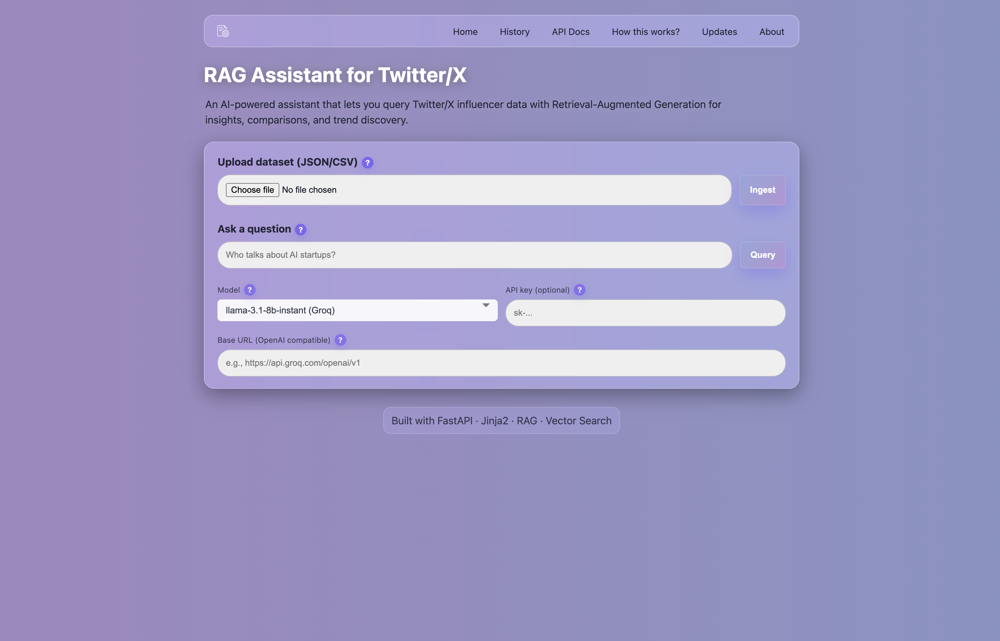
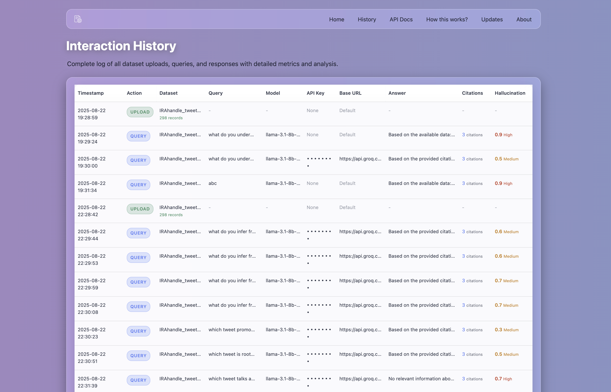

# 🐦 Twitter/X Influencer Knowledge Base (RAG Assistant)


AI-powered RAG system for querying Twitter/X influencer data with vector search and citations.

---

## 🖥️ Demo

### Homepage


### History Page


---

## 🚀 Quickstart

```bash
# Install dependencies
pip install -r infra/requirements.txt

# Run API
uvicorn app.api:app --reload

# Enable Web UI
ENABLE_WEB_UI=true uvicorn app.api:app --reload

# Run tests
pytest -q
```

**Access**: API at `http://127.0.0.1:8000`, Web UI at `http://127.0.0.1:8000/ui`

---

## ⚙️ Configuration

Create `.env` file:
```ini
OPENAI_API_KEY=your_key_here
OPENAI_MODEL=gpt-4o-mini
VECTOR_TOP_K=3
ENABLE_WEB_UI=true
```

---

## 🌐 API Endpoints

| Method | Path | Description |
|--------|------|-------------|
| GET | `/healthz` | Health check |
| POST | `/ingest` | Ingest dataset |
| POST | `/query` | Ask questions |
| POST | `/upload_dataset` | File upload |

---

## 🏗️ Project Structure

```
app/
├── api.py              # FastAPI app
├── embeddings.py       # Vector search
├── pipeline.py         # ETL pipeline
├── rag.py             # RAG engine
├── webui.py           # Web interface
└── templates/         # HTML templates
```

---

## 🐳 Docker

```bash
# Build & run
docker build -t twitter-assistant .
docker run -p 8000:8000 -e ENABLE_WEB_UI=true twitter-assistant

# Or use compose
docker-compose -f infra/docker-compose.yml up --build
```

---

## 📜 License

MIT License - Copyright (c) 2025 Siddhartha Srivastava
